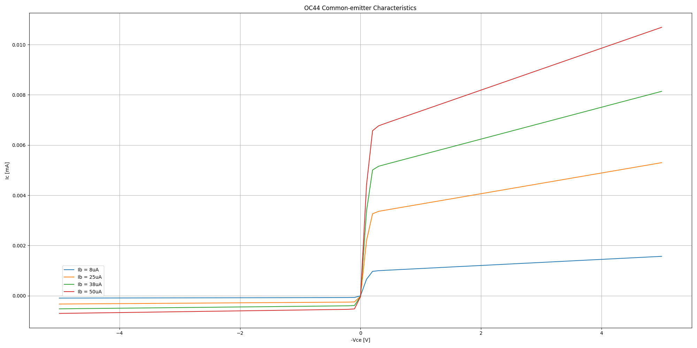
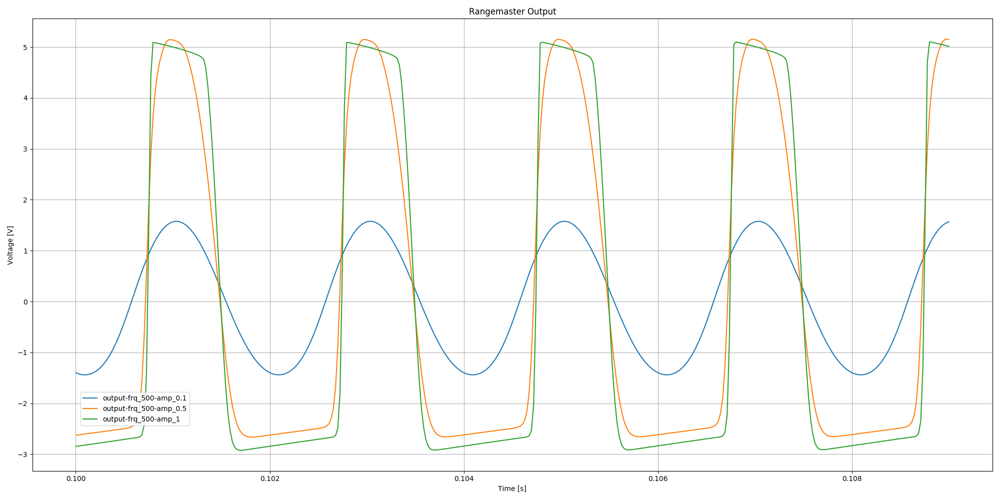
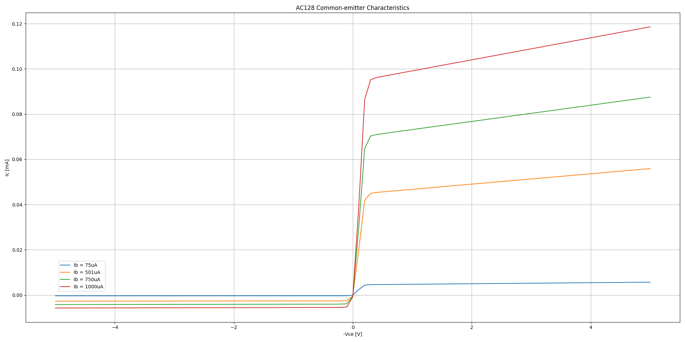
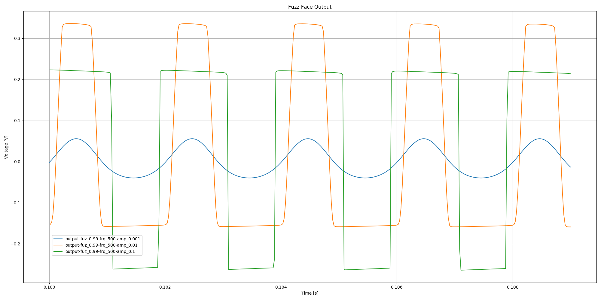

# Germanium BJT SPICE Models

Germanium BJT SPICE models based on Gummel-Poon parameters extracted from vintage OC44 and AC128 components by Holmes, Holters, and van Walstijn, as presented in [“Comparison of Germanium Bipolar Junction Transistor Models for Real-Time Circuit Simulation”, Proceedings of the 20th International Conference on Digital Audio Effects, Edinburgh, Scotland, Sept. 2017](http://benholmes.co.uk/publication/2017-09-05-Comparison%20of%20Germanium%20BJT%20models).

As a sanity check the models have been used with ngspice (v30) to reproduce results from the paper.

## OC44

```
* B. Holmes, M. Holters, M. van Walstijn. “Comparison of Germanium Bipolar Junction Transistor Models for Real-Time Circuit Simulation”, Proceedings of the 20th International Conference on Digital Audio Effects, Edinburgh, Scotland, Sept. 2017

.MODEL OC44 PNP(IS=1.423u BF=307.0 BR=20.27 NF=1.022 NR=1.025 VT=25.5m VAF=8.167 VAR=14.84 IKF=43.82m IKR=611.7m ISE=30.54n ISC=213.5n NE=1.316 NC=1.258 RB=32.83 RE=968.7m RC=989.9u CEB=410p CCB=10p)
```

Common-emitter characteristics plot (compare to figure 6 in paper):



Rangemaster response to 500Hz sinusoidal input (compare to figure 10 in paper):



## AC128

```
* B. Holmes, M. Holters, M. van Walstijn. “Comparison of Germanium Bipolar Junction Transistor Models for Real-Time Circuit Simulation”, Proceedings of the 20th International Conference on Digital Audio Effects, Edinburgh, Scotland, Sept. 2017

.MODEL AC128 PNP(IS=20.66u BF=229.6 BR=14.66 NF=1.133 NR=1.140 VT=25.5m VAF=19.68 VAR=88.28 IKF=463.0m IKR=241.5m ISE=2.190u ISC=7.546u NE=1.796 NC=1.364 RB=1.885 RE=306.4m RC=1.727u CCB=100p)
```

Common-emitter characteristics plot (compare to figure 7 in paper):



Fuzz Face response to 500Hz sinusoidal input (compare to figure 11 in paper):




